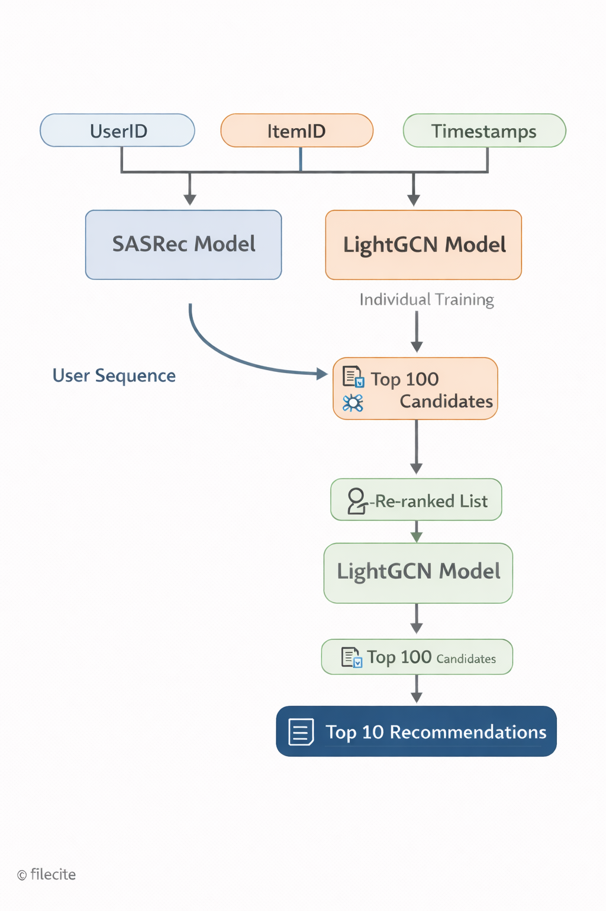

# Hybrid Neural Recommendation on MovieLens-32M

## Abstract

This repository presents research and implementation details for a high-performance **Hybrid Recommandation Engine** optimized for the **MovieLens-32M** dataset. By integrating Graph Convolutional Networks (GCNs) for relational collaborative filtering and Transformers for sequential behavioral modeling, the system achieves state-of-the-art precision in predicting user preferences across 32 million interactions. The architecture specifically addresses the cold-start problem and temporal drift inherent in large-scale user-item matrices.

---

## 1. Introduction

Traditional recommendation algorithms often struggle with the "curse of dimensionality" and sparsity when scaled to tens of millions of records. The MovieLens-32M dataset provides a rigorous benchmark for these challenges. Our approach employs a hybrid strategy that fuses three distinct paradigms:

1. **Relational Learning**: Capturing high-order connectivity between users and movies.
2. **Sequential Modeling**: Understanding the evolution of user tastes over time.
3. **Content-Based Filtering**: Leveraging rich metadata (genres, tags) for item similarity.

---

## 2. Dataset Overview: MovieLens-32M

The system is adapted for the **ML-32M** corpus, which consists of:

- **32,000,223** anonymous ratings.
- **2,000,072** tag applications.
- **87,585** movies.
- **162,541** unique users.

### Data Preprocessing

- **Temporal Stratification**: Data is split chronologically (80/10/10) to prevent data leakage from "future" interactions.
- **Feature Engineering**: Construction of a "Metadata Soup" utilizing user tags and cinematic genres to enrich item embeddings.
- **Normalization**: L2-normalization of sparse vectors to optimize dot-product inference latency.

---

## 3. Model Architecture



The core of the system is a **Weighted Neural Hybrid** model composed of the following sub-modules:

### 3.1. LightGCN (Collaborative Filtering)

We implement **LightGCN**, which simplifies the standard Graph Convolutional Network by removing non-linear activations and feature transformations. This allows for efficient embedding propagation over the user-item bipartite graph, capturing collaborative signals through $L$ layers of connectivity.

### 3.2. SASRec (Sequential Recommendation)

To capture temporal dynamics, we employ the **Self-Attentive Sequential Recommendation (SASRec)** model. Using a Transformer-based architecture with multi-head self-attention, the model identifies transient interests and long-term preferences within a user's interaction history.

### 3.3. Hybridization Strategy

The final recommendation score ($S$) is a linear fusion of component scores:
$$S_{final} = \alpha \cdot S_{GCN} + \beta \cdot S_{SAS} + (1 - \alpha - \beta) \cdot S_{Content}$$
Parameters $\alpha$ and $\beta$ are optimized via grid search on the validation set to maximize **NDCG@10**.

---

## 4. Implementation & Performance

### 4.2. Model Training (via Notebooks)

The `notebooks/` directory contains the complete research pipeline:

- `LightGCN_trainer.ipynb`: Graph construction and relational training.
- `SASRec_trainer.ipynb`: Sequential pattern mining.
- `Hybrid_Recommender_mock_up.ipynb`: Score fusion and alpha-tuning.

---

## 5. Getting Started

### Prerequisites

- Python 3.10+
- GPU recommended (A100 utilized during training)
- Libraries: `pandas`, `scikit-learn`, `pytorch`, `recbole`

### Installation

```bash
git clone https://github.com/illydh/movie-recs.git
cd movie-recs
pip install -r requirements.txt
```

---

## 6. Future Work: Multimodal Contextual Enrichment

To further enhance the representational power of the hybrid model, several trajectories for **Multimodal Contextual Enrichment** are currently under investigation:

1. **Semantic Textual Embeddings**: Utilizing Large Language Models (LLMs) like Llama 3 or BERT to generate high-dimensional embeddings from movie descriptions and plot summaries. These semantic vectors will be fused with the collaborative filtering embeddings to improve cold-start performance for new films.
2. **Visual Feature Extraction (Posters)**: Employing Convolutional Neural Networks (CNNs) or Vision Transformers (ViTs) to extract visual aesthetic features from movie posters, capturing genre-specific visual cues that influence user click-through rates.
3. **Sentiment & Rating Dynamics**: Incorporating granular rating trends and sentiment analysis from user reviews to weigh the influence of specific interactions based on qualitative feedback rather than binary or scalar ratings.
4. **Graph-Aware Context**: Integrating item attributes (release year, production budget) directly into the LightGCN message-passing protocol as node features.

## 7. References

1. **He, X., et al. (2020).** _LightGCN: Simplifying and Powering Graph Convolution Network for Recommendation._ SIGIR '20.
2. **Kang, W. C., & McAuley, J. (2018).** _Self-Attentive Sequential Recommendation._ IEEE ICDM.
3. **Harper, F. M., & Konstan, J. A. (2015).** _The MovieLens Datasets: History and Context._ ACM TiiS.

---
